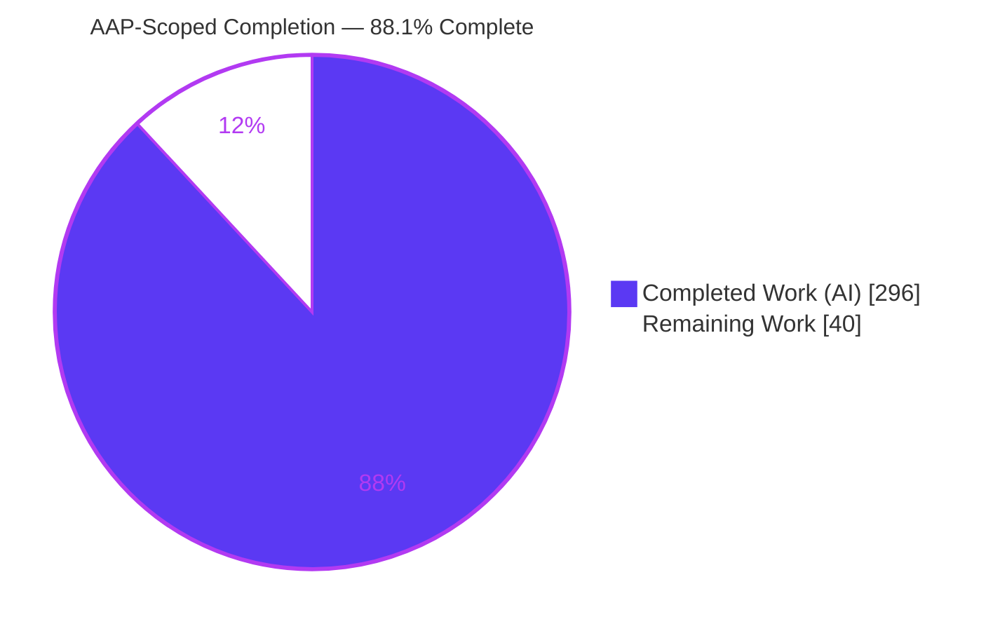
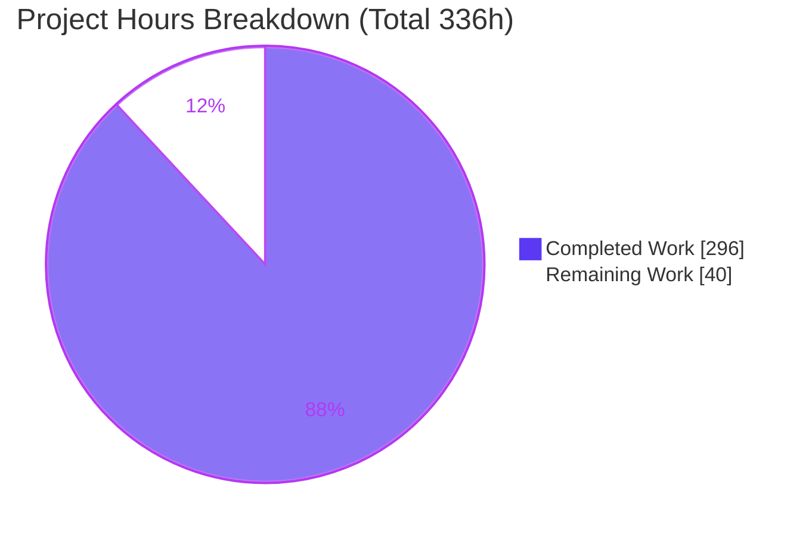
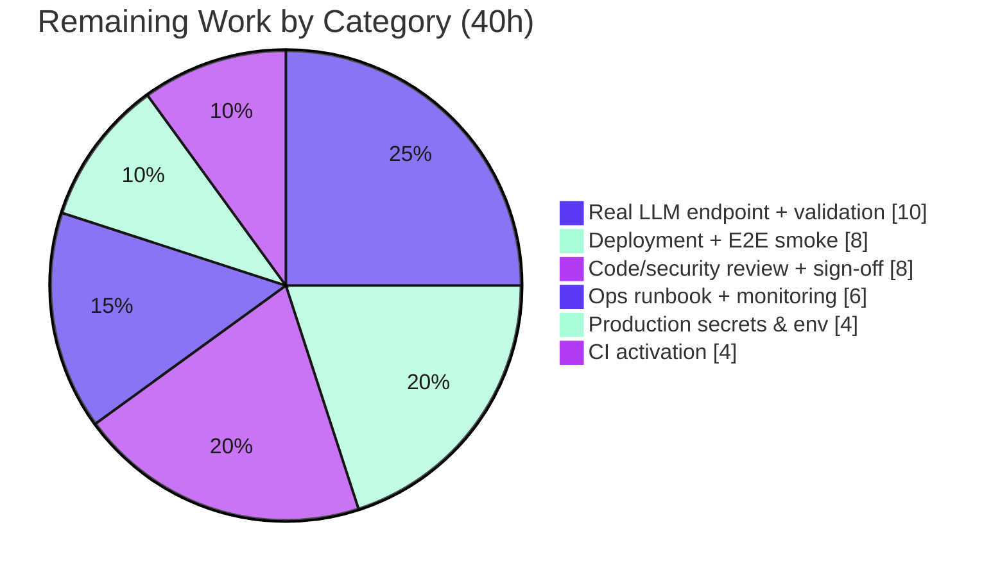

# Blitzy Project Guide — `recon-agent` Autonomous Reconciliation Sidecar

> Blitzy brand colors applied throughout: **Completed / AI Work = Dark Blue `#5B39F3`**, **Remaining / Not Completed = White `#FFFFFF`**, Headings/Accents = Violet-Black `#B23AF2`, Highlight = Mint `#A8FDD9`.

---

## 1. Executive Summary

### 1.1 Project Overview

This project adds **`recon-agent`**, a self-contained Go sidecar module, to the open-source **Blnk** double-entry ledger. The sidecar wraps Blnk's reconciliation HTTP surface with an autonomous, human-gated exception-resolution agent: it ingests an external statement, drives Blnk's reconciliation, classifies each unmatched "break" via an open-source LLM (Kimi K3 over an OpenAI-compatible endpoint), auto-remediates only high-confidence non-regulated cases — with **Blnk's dry-run as the sole arbiter of clearance** — and routes everything else to a human-in-the-loop (HITL) queue, recording every action to an append-only audit trail. It is **strictly additive**: Blnk's ledger, reconciliation, lineage, transaction, and model code are untouched. Target users are finance-operations and reconciliation teams.

### 1.2 Completion Status

The project is **88.1% complete** on an AAP-scoped basis (PA1 methodology: `Completed Hours / (Completed + Remaining) × 100 = 296 / 336`). All AAP-specified engineering deliverables were delivered autonomously by Blitzy agents; the remaining 40 hours are exclusively **path-to-production** activities that require human action (real LLM endpoint provisioning, production secrets, target-environment deployment, CI activation, human sign-off, and operational monitoring).



| Metric | Hours |
|--------|-------|
| **Total Hours** | **336** |
| **Completed Hours (AI + Manual)** | **296** (296 AI + 0 Manual) |
| **Remaining Hours** | **40** |
| **Percent Complete** | **88.1%** |

### 1.3 Key Accomplishments

- ✅ New independently-buildable Go module `github.com/blnkfinance/recon-agent` (Go 1.25.0) — 8 internal packages, `cmd` entrypoint, ~10.7k source LOC + ~16.1k test LOC across **47 changed files / 28,765 insertions** in 24 commits.
- ✅ All **six** feature requirements implemented and validated: ingestion+kickoff, break retrieval, LLM classification, auto-remediation with deterministic verification, HITL gate (accept/re_drive/reject), and append-only audit.
- ✅ All **nine** mandatory rules (5.1–5.9) satisfied — several enforced at the **database boundary** (append-only trigger, resolved-proof `CHECK` requiring a Blnk `recon_id`).
- ✅ All **seven** applicable gates (1, 2, 8, 9, 10, 12, 13) passed with concrete evidence.
- ✅ **91.6%** module test coverage (Rule 5.9 floor is 80%); **703 test cases** (461 functions + 242 subtests) pass with zero failures.
- ✅ End-to-end `make demo` completes in **1.21s** (budget ≤ 60s): 6 breaks in → 3 auto-resolved (Blnk-confirmed) → 3 escalated → 21 audit events; acceptance scorer green on all 10 criteria (labels 6/6).
- ✅ HITL UI browser-validated live (status page + all three decision flows) with hardened headers (CSP, `X-Frame-Options: DENY`, CSRF).
- ✅ Additive orchestration & automation delivered: `docker-compose.yaml` `recon-agent` service (loopback-only HITL, two-role least-privilege DB), `makefile` `seed`/`demo`/`test` targets, `.env.example`, and a CI workflow with rule/supply-chain audits + `govulncheck`.
- ✅ Blnk core preserved: root `go.mod`/`go.sum` byte-unchanged; zero `reconciliation*.go`/`lineage*.go`/`transaction*.go`/`model/**` files modified.

### 1.4 Critical Unresolved Issues

There are **no unresolved in-scope engineering defects.** The items below are path-to-production gaps (not code defects) that block a real production cutover until a human completes them.

| Issue | Impact | Owner | ETA |
|-------|--------|-------|-----|
| No real LLM endpoint wired (demo uses a deterministic stub; default `LLM_BASE_URL` is non-routable → fail-closed) | Auto-remediation stays dormant; every break escalates to HITL until a real Kimi K3 / OpenAI-compatible endpoint is provisioned | Platform / ML Ops | ~1 day |
| Production secrets not set (`LLM_API_KEY`, `BLNK_API_KEY` ship empty; `.env` is gitignored) | Agent cannot authenticate to Blnk / LLM in a real environment | DevOps | ~0.5 day |
| Not yet deployed/smoke-tested on target environment against real Blnk + real LLM | Production behavior unverified end-to-end outside the local validation host | DevOps | ~1 day |
| Human security review + HITL exposure decision pending | HITL API is unauthenticated by design (loopback-only default); exposure beyond localhost needs a fronting auth/network decision | Security | ~1 day |

### 1.5 Access Issues

| System/Resource | Type of Access | Issue Description | Resolution Status | Owner |
|-----------------|----------------|-------------------|-------------------|-------|
| Kimi K3 / OpenAI-compatible LLM endpoint | API base URL + key | No real endpoint provisioned; `LLM_BASE_URL` default is a non-routable placeholder and `LLM_API_KEY` is empty | Open — human provisioning required | Platform / ML Ops |
| Blnk reconciliation API (`X-Blnk-Key`) | API key | `BLNK_API_KEY` ships empty; a real key is required for authenticated `/reconciliation/*` calls in production | Open — human secret injection | DevOps |
| CI/CD platform (GitHub Actions) | Repo/org secrets | `recon-agent.yml` workflow authored but not yet run with live secrets on a hosted runner | Open — CI activation | DevOps |
| Production PostgreSQL | DB credentials | Agent runtime/migrator role passwords are placeholders in `.env.example`; real credentials required | Open — human secret injection | DevOps |

> Note: These are expected first-deployment configuration items, not repository-permission blockers. All source is committed on branch `blitzy-2e9e4275-5eda-4329-92b8-66ede77ab436`.

### 1.6 Recommended Next Steps

1. **[High]** Provision and validate a real Kimi K3 (or self-hosted OpenAI-compatible, e.g. vLLM) endpoint; set `LLM_BASE_URL`/`LLM_MODEL`; run a real-model classification accuracy pass on the 6-break seed and tune the prompt if outputs drift. *(~10h)*
2. **[High]** Inject production secrets (`LLM_API_KEY`, `BLNK_API_KEY`, DB credentials) via a secrets manager and set the target-environment configuration. *(~4h)*
3. **[High]** Deploy to the target environment (`docker compose up --build` against a **fresh** Postgres) and run `make seed && make demo` end-to-end against real Blnk + real LLM. *(~8h)*
4. **[High]** Complete human code & security review, decide the HITL exposure model (keep loopback / front with auth), and sign off for production. *(~8h)*
5. **[Medium]** Activate CI (org secrets + first green run + branch protection) and author the ops runbook + wire monitoring/alerts for the agent and HITL queue depth. *(~10h)*

---

## 2. Project Hours Breakdown

### 2.1 Completed Work Detail

All work below was completed autonomously by Blitzy agents (AI). Every component traces to a specific AAP requirement.

| Component | Hours | Description |
|-----------|-------|-------------|
| Module foundation + Dockerfile | 8 | `recon-agent/go.mod`+`go.sum` (exact pins incl. `go-openai v1.41.2`); multi-stage digest-pinned Dockerfile (`golang:1.25-alpine` → `alpine:3.22`). |
| Config loader + validation | 10 | `internal/config` — all `LLM_*`/`BLNK_*`/`CONF_AUTO_THRESHOLD`/`HITL_PORT`/`AGENT_*` fields with validation; Gate 12 write/read tracing. |
| Entrypoint & component wiring | 14 | `cmd/main.go` — config → boot migration → wire graph → run pipeline (`-once`) → serve HITL; signal handling. |
| Blnk HTTP client seam | 18 | `internal/blnk/client.go` — sole Blnk I/O: 6 routes + `ProbeBreak` per-break dry-run bridge + `X-Blnk-Key` + custom redirect safety + readiness. |
| Blnk DTOs | 4 | `internal/blnk/types.go` — locally-declared DTOs mirroring Blnk JSON (Rule 5.1 forbids importing `model/`). |
| LLM classifier + prompt | 16 | `internal/classifier` — `go-openai` chat completion, 7-value `root_cause` enum, confidence, `regulated`, proposed rule; 2-retry fail-closed (Rule 5.7). |
| Rule-grammar validator | 6 | `internal/classifier/grammar.go` — Field/Operator domain enforcement before any POST (Rule 5.2). |
| Remediator gate + dry-run confirm | 22 | `internal/remediator` — confidence/regulation gate (Rule 5.4) + propose-rule → dry-run → confirm-cleared loop; `resolved` only on Blnk clearance with `recon_id` (Rule 5.3). |
| Persistence store + schema | 24 | `internal/store` + `schema.sql` — `agent` schema, 3 tables, append-only trigger, resolved-proof `CHECK`, boot migration, two-role least-privilege model. |
| Append-only audit writer | 12 | `internal/audit` — INSERT-only writer with atomicity + validation (Rule 5.5). |
| HITL surface | 24 | `internal/hitl` — Gin API (`/healthz`, `/`, `/breaks`, `/decisions`), accept/re_drive/reject handlers, server-rendered status page, CSRF + leases. |
| Domain/model contracts | 4 | `internal/model` — `BreakClassification`, `AuditEvent`+provenance, `HITLDecision`. |
| Seed program + fixtures | 14 | `seed/` — creates ledger/balances/internal txns via Blnk HTTP, then uploads the 6-break external CSV. |
| Evaluation harness | 12 | `eval/` — deterministic OpenAI-compatible `llmstub`, 10-criteria `scorer`, `recon_corpus.jsonl`. |
| Additive orchestration/automation | 10 | `docker-compose.yaml` `recon-agent` service, `makefile` `seed`/`demo`/`test`, `.env.example`. |
| CI pipeline | 10 | `.github/workflows/recon-agent.yml` — build/static/supply-chain + live integration jobs; Rule 5.6/5.8 audits + `govulncheck`. |
| Unit/component test suite | 48 | 461 test functions + 242 subtests (703 cases), testify assertions/mocks, **91.6%** coverage. |
| Integration + E2E + demo scoring | 10 | `//go:build integration` `TestReconAgentPipeline` against live Blnk; `make demo` scoring harness. |
| QA hardening | 30 | 23 remediation commits resolving code-review/QA findings (7 critical + 23 major rounds, supply-chain, HITL, immutability). |
| **Total Completed** | **296** | |

### 2.2 Remaining Work Detail

Each category is path-to-production and traces to a specific remaining AAP/deployment need. **Total = 40h**, matching Section 1.2 Remaining Hours and the Section 7 pie chart.

| Category | Hours | Priority |
|----------|-------|----------|
| Provision & validate real Kimi K3 / OpenAI-compatible LLM endpoint (incl. real-model accuracy pass + prompt tuning) | 10 | High |
| Configure production secrets & environment (`LLM_API_KEY`, `BLNK_API_KEY`, DB credentials, target-env vars) | 4 | High |
| Target-environment deployment + end-to-end smoke on a fresh Postgres (`compose up` → `seed` → `demo` against real Blnk + real LLM) | 8 | High |
| CI activation (org/repo secrets, first green run on hosted runner, branch protection) | 4 | Medium |
| Human code & security review + HITL exposure decision + production sign-off | 8 | High |
| Operational runbook (fresh-Postgres requirement + documented Blnk NULL limitation) + monitoring/alerts | 6 | Medium |
| **Total Remaining** | **40** | |

### 2.3 Hours Reconciliation Summary

| Bucket | Hours | Cross-Section Check |
|--------|-------|---------------------|
| Completed (Section 2.1 sum) | 296 | = Section 1.2 Completed = Section 7 "Completed Work" |
| Remaining (Section 2.2 sum) | 40 | = Section 1.2 Remaining = Section 7 "Remaining Work" = Human-task total (Appendix F) |
| **Total** | **336** | = 296 + 40 = Section 1.2 Total (Integrity Rule 2 ✓) |
| Completion | 88.1% | 296 / 336 × 100 = 88.0952% (Integrity Rule 1 ✓) |

---

## 3. Test Results

All tests below originate from Blitzy's autonomous validation logs for this project and were **independently re-executed** during this assessment (recon-agent unit suite re-run: 703 cases, 0 failures, 91.6% coverage confirmed). Integration/E2E and browser rows reflect Blitzy's live-infra validation runs (require a live Blnk + Postgres, and were executed by the autonomous validation system).

| Test Category | Framework | Total Tests | Passed | Failed | Coverage % | Notes |
|---------------|-----------|-------------|--------|--------|------------|-------|
| Unit / Component | Go `testing` + `testify` | 703 (461 funcs + 242 subtests) | 703 | 0 | 91.6% (module) | Per-package: cmd 78.6%, audit 99.2%, blnk 95.8%, classifier 99.0%, config 100%, hitl 96.0%, remediator 97.4%, store 88.7%. |
| Integration / E2E | Go `testing` (`//go:build integration`) | 1 (`TestReconAgentPipeline`) | 1 | 0 | — | Live Blnk + agent DB: 6 breaks → 3 auto-resolved (Blnk-confirmed) → 3 escalated → 21 audit events (~674ms). |
| Acceptance / Scoring | `eval/scorer` (10 criteria) | 10 | 10 | 0 | — | `make demo` 1.21s; labels 6/6 (≥5 req), ≥1 Blnk-confirmed auto-resolution (3), routing safety 0 violations, disposition 6=3+3, audit ≥1/break (21≥6). |
| Seed | Go `testing` | 1 | 1 | 0 | — | Seed idempotency / fixture load. |
| UI / Browser (HITL) | Chrome subagent (headless) | 3 flows | 3 | 0 | — | accept (EXT-004), re_drive (EXT-005, real Blnk dry-run + `recon_id`), reject (EXT-006); POST `/decisions` 303→200; zero console errors; hardened headers. |

**Aggregate:** 718 autonomous test executions across all categories, **0 failures**. Coverage gate (Rule 5.9 ≥ 80%) satisfied at 91.6%.

---

## 4. Runtime Validation & UI Verification

**Runtime Health**
- ✅ **Blnk daemon** — live on `:5001`, `/health` → `{"status":"UP"}`.
- ✅ **recon-agent pipeline** — `make demo` completes end-to-end in 1.21s (≤ 60s budget); summary `{breaks_in:6, auto_resolved:3, escalated:3, audit_count:21}`.
- ✅ **Agent database** — `agent` schema + `agent_break`/`agent_audit`/`agent_hitl_queue` created via boot migration (two-role least-privilege model).
- ✅ **HITL server** — serves on loopback `127.0.0.1:8088`; `/healthz`, `/`, `/breaks`, `/decisions` all responsive.
- ✅ **Build/vet** — `go build ./...` and `go vet ./...` clean (zero warnings) for recon-agent, seed, and eval (independently re-verified).

**API Integration Outcomes**
- ✅ Blnk `/reconciliation/*` consumed exclusively over HTTP with `X-Blnk-Key` (Rule 5.1); upload/start/start-instant/get/matching-rules all exercised.
- ✅ Per-break status bridge (`ProbeBreak` via `start-instant` `dry_run=true`) drives deterministic clearance; `resolved` events carry a Blnk `recon_id` (Rule 5.3).
- ⚠ **LLM endpoint** — validated against a deterministic OpenAI-compatible stub; a real Kimi K3 endpoint is **not yet wired** (default is non-routable → fail-closed). Real-model behavior is a remaining validation item.

**UI Verification (HITL status page, Chrome subagent — PASS)**
- ✅ Status page renders: breaks table (`external_txn_id`, `root_cause`, `confidence`, `regulated`, status), audit trail, and decision controls.
- ✅ **accept** EXT-004 → queued→accepted; **re_drive** EXT-005 → real Blnk dry-run, `recon_id` recorded, correctly stayed queued (non-clearing re-drive per spec); **reject** EXT-006 → queued→rejected.
- ✅ Security posture: CSP, `X-Frame-Options: DENY`, CSRF token+cookie; HTML5-required blocks empty reviewer client-side; zero console errors, zero failed requests.
- ✅ Artifacts saved under `blitzy/screenshots/` and `blitzy/screen_recordings/`.

---

## 5. Compliance & Quality Review

AAP deliverables cross-mapped to Blitzy's quality/compliance benchmarks. All nine mandatory rules and seven applicable gates pass.

| Benchmark | Requirement | Status | Evidence / Fixes Applied |
|-----------|-------------|--------|--------------------------|
| Rule 5.1 Native-API-only | No Blnk internal imports | ✅ Pass | Zero real `github.com/blnkfinance/blnk/` imports (2 comment-only refs); all coupling via HTTP. |
| Rule 5.2 Rule-grammar | Field/Operator domain | ✅ Pass | `grammar.go` allowed-sets + `ValidateRule`; out-of-domain rejected before POST; unit tests present. |
| Rule 5.3 Deterministic arbiter | `resolved` only on Blnk dry-run | ✅ Pass | DB `agent_audit_resolved_proof` CHECK forces `provenance->>'recon_id'`; live 3/3 resolved carry `recon_id`. |
| Rule 5.4 Confidence gate | No auto-remediate if conf<0.85 OR regulated | ✅ Pass | Gate in remediator + regulated backstop; live EXT-006 (conf 0.92, regulated) escalated, not actioned. |
| Rule 5.5 Audit immutability | Append-only `agent_audit` | ✅ Pass | DB trigger `agent_audit_reject_mutation()` rejects UPDATE/DELETE/TRUNCATE; store issues no UPDATE/DELETE. |
| Rule 5.6 Open-source binding | `go-openai` only, config-driven model | ✅ Pass | `go-openai v1.41.2` exact pin; zero proprietary GenAI SDKs; model from `cfg.LLMModel`/`LLMBaseURL`; CI grep-guards. |
| Rule 5.7 Fail-closed | 2-retry cap → HITL | ✅ Pass | `defaultMaxRetries=2`; fault-injection tests route to HITL. |
| Rule 5.8 Blnk-core preservation | No protected-file edits | ✅ Pass | Root `go.mod`/`go.sum` byte-unchanged; zero `reconciliation*/lineage*/transaction*/model/` edits (`git diff --name-only`). |
| Rule 5.9 Coverage floor | ≥ 80% | ✅ Pass | 91.6% module coverage; `make test` gate enforced. |
| Gate 1 End-to-End Boundary | `make demo` via live Blnk | ✅ Pass | 1.21s live run. |
| Gate 2 Zero-Warning Build | `go vet` + `go build` clean | ✅ Pass | Independently re-verified exit 0. |
| Gate 8 Integration Sign-Off | ≤ 60s + dep audit | ✅ Pass | 1.21s; `govulncheck` + no-proprietary-SDK audit in CI. |
| Gate 9 Integration Wiring | ≥ 1 integration test | ✅ Pass | `TestReconAgentPipeline`. |
| Gate 10 Test Execution Binding | single `make test` + CI infra | ✅ Pass | `make test` green; CI stands up postgres:16+redis+typesense. |
| Gate 12 Config Propagation | write-site + read-site per field | ✅ Pass | Every config field has a read-site (e.g. `HitlPort`, `AgentMigrateDatabaseURL`). |
| Gate 13 Registration-Invocation | HITL routes have invocation tests | ✅ Pass | accept/re_drive/reject unit tests + live browser POSTs. |

**Fixes applied during autonomous validation:** commit `616ad55` (gofmt doc-comment headings in `eval/llmstub` + `eval/scorer`; comments only). Two environmental (non-code) DB-pollution issues were resolved non-destructively via a fresh agent database.

**Outstanding compliance items:** none in-scope. One out-of-scope Blnk-core limitation is documented (see Risk O1) and is Rule-5.8-protected (must not be modified).

---

## 6. Risk Assessment

| Risk | Category | Severity | Probability | Mitigation | Status |
|------|----------|----------|-------------|------------|--------|
| T1 — Real Kimi K3 classification accuracy unverified (validated against deterministic stub only) | Technical | Medium | Medium | Fail-closed routes non-conformant/low-confidence to HITL; run real-model accuracy pass + prompt tuning before enabling auto-remediation | Open (mitigated by fail-closed) |
| T2 — `cmd` package coverage 78.6% (boot/signal/wiring paths) | Technical | Low | Low | Module aggregate 91.6% satisfies module-level Rule 5.9; optional boot-path tests | Accepted |
| T3 — Integration/E2E suite is build-tag gated (excluded from fast unit runs) | Technical | Low | Low | CI job stands up live infra and runs the tagged suite (Gate 10) | Mitigated |
| S1 — HITL API/status page unauthenticated by design | Security | High (if misdeployed) | Low–Medium | Loopback-only publish by default + CSRF/CSP/`X-Frame-Options` defense-in-depth; require reverse-proxy auth/network policy before any non-local exposure | Open (deployment decision) |
| S2 — Production secrets not set (`LLM_API_KEY`/`BLNK_API_KEY` empty) | Security | Medium | Medium | Inject via secrets manager; never commit; `.env` gitignored | Open (task H2) |
| S3 — Community/unofficial LLM client (`go-openai`) | Security | Low | Low | Intentional per Rule 5.6; CI `govulncheck` + exact version pin + dep-audit grep | Mitigated |
| O1 — Shared-Postgres pollution triggers out-of-scope Blnk `transaction_grouping` NULL → 500 | Operational | Medium | Low | Deploy on a **fresh** Postgres (compose path never polluted); Rule-5.8-protected, cannot fix; documented | Documented / Accepted |
| O2 — No production monitoring/alerting for agent health or HITL queue depth | Operational | Medium | Medium | Wire logs/metrics/alerts (task M2) | Open |
| O3 — `make demo` uses deterministic stub (not real inference) | Operational | Low | Low | Clearly documented in makefile + llmstub; production uses `LLM_BASE_URL` | Documented |
| I1 — Real OpenAI-compatible endpoint availability/latency | Integration | Medium | Medium | Fail-closed is safe (breaks → HITL); provision reliable endpoint; timeouts already bounded | Open (task H1) |
| I2 — Blnk API key/base-URL misconfiguration | Integration | Low–Medium | Low | Config validation present; smoke test on deploy (task H3) | Mitigated (needs prod values) |
| I3 — Blnk reconciliation JSON contract drift (local DTOs per Rule 5.1) | Integration | Low | Low | `httptest` client mocks + live integration test pin the contract; version-pin Blnk image | Mitigated |

**Highest-attention risks:** S1 (HITL exposure — safe by default, needs an explicit exposure decision) and T1/I1 (real-model behavior unverified — safe by fail-closed design). None are in-scope code defects.

---

## 7. Visual Project Status

**AAP-Scoped Hours (Completed vs Remaining)** — "Remaining Work" (40) equals Section 1.2 Remaining Hours and the Section 2.2 total.



**Remaining Hours by Category (Section 2.2)**



**Remaining Work by Priority**

| Priority | Hours | Share |
|----------|-------|-------|
| High | 30 | 75% |
| Medium | 10 | 25% |
| **Total** | **40** | **100%** |

---

## 8. Summary & Recommendations

**Achievements.** The `recon-agent` feature is **functionally complete and internally production-quality**. All six feature requirements, all nine mandatory rules, and all seven applicable gates pass with concrete, independently re-verified evidence. The module compiles and vets cleanly, carries **91.6%** test coverage across **703 passing test cases**, runs its full pipeline end-to-end in **1.21s**, and preserves Blnk's core byte-for-byte. Safety-critical invariants (deterministic Blnk arbiter, confidence/regulation gate, append-only audit, fail-closed inference) are enforced at the database boundary — not merely by convention.

**Remaining gaps (path-to-production).** The project is **88.1% complete** (296 of 336 hours). The remaining **40 hours** are not code defects; they are deployment-time activities that inherently require human action: provisioning and validating a **real** Kimi K3 / OpenAI-compatible endpoint (the pipeline has only been exercised against a deterministic stub), injecting production secrets, deploying and smoke-testing on the target environment against a fresh Postgres, activating CI with real secrets, completing a human security review and HITL exposure decision, and wiring operational monitoring.

**Critical path to production.** (1) Real LLM endpoint + validation → (2) production secrets → (3) target-environment deploy + E2E smoke → (4) security review + sign-off, then (5) CI activation and monitoring in parallel. High-priority items total 30h; medium-priority 10h.

**Success metrics (all met autonomously):** ≥5/6 root-cause labels (achieved 6/6); ≥1 Blnk-confirmed auto-remediation (achieved 3); 100% of actions audited (21 events for 6 breaks); every low-confidence/regulated break routed to HITL with zero auto-action violations; `make demo` ≤ 60s (achieved 1.21s).

**Production readiness assessment.** **Ready for staging / pre-production integration; not yet in production.** The code is release-candidate quality; the gate to production is completing the 40h of human-owned deployment, validation-against-real-inference, and sign-off work above. Consistent with honest-assessment principles, this guide does not claim 100% completion while human review and real-endpoint validation remain outstanding.

---

## 9. Development Guide

### 9.1 System Prerequisites
- **Go 1.25.x** (module declares `go 1.25.0`; validated with `go1.25.12`).
- **Docker Engine 28.x** + **Docker Compose v2** (use `docker compose`, not `docker-compose`).
- **Git** + **Git LFS**.
- Blnk infrastructure (provided by compose): **PostgreSQL 16**, **Redis 7.2.4**, **Typesense 29.0**.
- **Production only:** a reachable **OpenAI-compatible LLM endpoint** (Kimi K3 / Moonshot, or self-hosted vLLM). The `make demo` flow uses a **bundled deterministic stub** and needs no external LLM.

### 9.2 Environment Setup
```bash
# From the repository root
cp .env.example .env
# Edit .env and set at minimum:
#   POSTGRES_PASSWORD=<your-password>
#   LLM_BASE_URL=<your OpenAI-compatible endpoint, e.g. https://api.moonshot.ai/v1>
#   LLM_API_KEY=<your key>          # leave empty to force fail-closed (all breaks → HITL)
#   LLM_MODEL=kimi-k3
#   BLNK_API_KEY=<your Blnk X-Blnk-Key>
#   CONF_AUTO_THRESHOLD=0.85
#   HITL_PORT=8088
```
Key variables: `LLM_BASE_URL`, `LLM_API_KEY`, `LLM_MODEL` (default `kimi-k3`), `BLNK_BASE_URL`, `BLNK_API_KEY`, `CONF_AUTO_THRESHOLD` (default `0.85`), `AGENT_BASE_CURRENCY` (default `USD`), `HITL_PORT` (default `8088`), `AGENT_RUN_ON_BOOT` (default `false`), `AGENT_DATABASE_URL` (runtime role), `AGENT_MIGRATE_DATABASE_URL` (migrator role).

### 9.3 Dependency Installation & Build
```bash
# Option A — full stack via Docker (recommended for a clean machine)
docker compose up --build -d          # postgres, redis, typesense, jaeger, server, worker, recon-agent

# Option B — local Go build (verified offline in this assessment)
cd recon-agent && go mod download && go build ./... && go vet ./...   # exit 0, zero warnings
cd .. && go build -o blnk ./cmd/*.go                                   # root Blnk binary
go build -o /tmp/seed_bin ./seed                                       # seed program
go build ./eval/llmstub ./eval/scorer                                  # eval harness
```

### 9.4 Application Startup
```bash
# Full stack (Docker): Blnk on :5001, recon-agent HITL on 127.0.0.1:8088
docker compose up --build -d

# Local (manual) order: start infra containers, then:
./blnk migrate up        # apply Blnk migrations
./blnk start             # Blnk server on :5001
# recon-agent boots serve-only by default (AGENT_RUN_ON_BOOT=false)
```
**Port reference:** Blnk `5001`, Blnk worker `5004`, PostgreSQL `5432`, Redis `6379`, Typesense `8108`, Jaeger UI `16686`, OTLP `4317/4318`, Prometheus `9090`, **HITL `127.0.0.1:8088` (loopback-only)**, demo LLM stub `127.0.0.1:11434`.

### 9.5 Verification Steps
```bash
curl -s http://localhost:5001/health            # -> {"status":"UP"}
curl -s http://127.0.0.1:8088/healthz           # HITL liveness
make seed                                        # ledger/balances/internal txns + upload 6-break CSV
make demo                                        # runs pipeline (<=60s); prints summary; writes recon_summary.json + recon_resolved.jsonl
make test                                        # unit + >=80% coverage gate + integration + root smoke
```
Expected `make demo` summary: `{"breaks_in":6,"auto_resolved":3,"escalated":3,"audit_count":21}` (with the deterministic stub).

Offline-verified during this assessment: `go build ./...`, `go vet ./...`, `go test ./...` (91.6% coverage, gate PASS), `go mod verify` (“all modules verified”), `docker compose config` (VALID).

### 9.6 Example Usage (HITL API)
```bash
# JSON view of current breaks
curl -s http://127.0.0.1:8088/breaks | python3 -m json.tool
# Status page (HTML) in a browser
open http://127.0.0.1:8088/            # decision controls POST to /decisions (accept | re_drive | reject)
```

### 9.7 Troubleshooting
- **All breaks escalate to HITL / zero auto-resolutions** → `LLM_BASE_URL` is unreachable → classifier fails closed (Rule 5.7, safe). Set a real endpoint (or run `make demo`, which launches the bundled stub).
- **Blnk returns 500 on reconciliation/search** after running Blnk's **own** root test suite → shared-DB `NULL parent_transaction` pollution (out-of-scope Blnk-core limitation). **Use a fresh Postgres** for the agent; the compose deployment path never carries this pollution.
- **`go build` "output ... already exists and is a directory"** → build with an explicit output: `go build -o /tmp/seed_bin ./seed`.
- **Coverage gate fails** → inspect per-package coverage: `cd recon-agent && go test ./... -cover` or `go tool cover -func=<profile>`.
- **HITL not reachable from another host** → this is intentional (loopback-only publish). Front it with an authenticated reverse proxy before any non-local exposure.

---

## 10. Appendices

### A. Command Reference
| Command | Purpose |
|---------|---------|
| `docker compose up --build -d` | Bring up Blnk + Postgres + Redis + Typesense + recon-agent |
| `make seed` | Load ledger/balances/internal txns + upload 6-break external CSV |
| `make demo` | Run the pipeline end-to-end (≤ 60s); print summary; write outputs |
| `make test` | Unit tests + ≥ 80% coverage gate + integration + root smoke |
| `cd recon-agent && go build ./... && go vet ./...` | Zero-warning build/vet (Gate 2) |
| `cd recon-agent && go test ./... -cover` | Unit tests with per-package coverage |
| `go build -o blnk ./cmd/*.go` | Build the root Blnk binary |
| `./blnk migrate up` / `./blnk start` | Apply Blnk migrations / start Blnk server |
| `docker compose config` | Validate compose configuration |

### B. Port Reference
| Service | Port |
|---------|------|
| Blnk server | 5001 |
| Blnk worker | 5004 |
| PostgreSQL | 5432 |
| Redis | 6379 |
| Typesense | 8108 |
| Jaeger UI | 16686 |
| OTLP (gRPC/HTTP) | 4317 / 4318 |
| Prometheus | 9090 |
| **HITL API + status page** | **127.0.0.1:8088** (loopback-only) |
| Demo LLM stub | 127.0.0.1:11434 |

### C. Key File Locations
| Path | Role |
|------|------|
| `recon-agent/cmd/main.go` | Entrypoint: config → migrate → wire → pipeline → serve |
| `recon-agent/internal/blnk/{client.go,types.go}` | Sole Blnk HTTP client + local DTOs |
| `recon-agent/internal/classifier/{classifier.go,prompt.go,grammar.go}` | LLM classification, prompts, rule-grammar |
| `recon-agent/internal/remediator/remediator.go` | Confidence gate + propose/dry-run/confirm |
| `recon-agent/internal/audit/audit.go` | Append-only audit writer |
| `recon-agent/internal/store/{store.go,schema.sql}` | Persistence + `agent_*` DDL, triggers, CHECKs |
| `recon-agent/internal/hitl/{server.go,handler.go,status_page.go}` | HITL API + decisions + status page |
| `seed/{main.go,external_transactions.csv,internal_ledger.json}` | Demo seed + fixtures |
| `eval/{llmstub,scorer}/main.go`, `eval/recon_corpus.jsonl` | Deterministic stub, scorer, corpus |
| `docker-compose.yaml`, `makefile`, `.env.example` | Additive orchestration/automation/config |
| `.github/workflows/recon-agent.yml` | CI (build/static/supply-chain + live integration) |

### D. Technology Versions
| Technology | Version |
|------------|---------|
| Go | 1.25.0 (module) / 1.25.12 (validated) |
| `github.com/sashabaranov/go-openai` | v1.41.2 (exact pin) |
| `github.com/gin-gonic/gin` | v1.10.0 |
| `github.com/lib/pq` | v1.10.9 |
| `github.com/google/uuid` | v1.6.0 |
| `github.com/stretchr/testify` | v1.11.1 |
| PostgreSQL | 16 |
| Redis | 7.2.4 |
| Typesense | 29.0 |
| Docker base images | `golang:1.25-alpine3.23` → `alpine:3.22` (digest-pinned) |

### E. Environment Variable Reference
| Variable | Default | Purpose |
|----------|---------|---------|
| `LLM_BASE_URL` | `http://localhost:11434/v1` | OpenAI-compatible endpoint (non-routable default → fail-closed) |
| `LLM_API_KEY` | *(empty)* | LLM auth key (set in production) |
| `LLM_MODEL` | `kimi-k3` | Model name (config-driven, Rule 5.6) |
| `BLNK_BASE_URL` | `http://localhost:5001` | Blnk API base URL |
| `BLNK_API_KEY` | *(empty)* | `X-Blnk-Key` (set in production) |
| `CONF_AUTO_THRESHOLD` | `0.85` | Auto-remediation confidence floor (Rule 5.4) |
| `AGENT_BASE_CURRENCY` | `USD` | Regulated-currency backstop reference |
| `HITL_PORT` | `8088` | HITL server port (published loopback-only) |
| `AGENT_RUN_ON_BOOT` | `false` | Serve-only by default; `true` runs pipeline once on boot |
| `AGENT_DATABASE_URL` | *(compose default)* | Restricted runtime DB role DSN |
| `AGENT_MIGRATE_DATABASE_URL` | *(compose default)* | Owner/migrator DB role DSN |

### F. Human Task List (Developer Tools Guide)
Path-to-production tasks. **Total = 40h** (matches Section 2.2 and Section 1.2 Remaining).

| ID | Priority | Hours | Task |
|----|----------|-------|------|
| H1 | High | 10 | Provision & validate real Kimi K3 / OpenAI-compatible endpoint; real-model accuracy pass on 6-break seed + prompt tuning if drift |
| H2 | High | 4 | Inject production secrets (`LLM_API_KEY`, `BLNK_API_KEY`, DB creds) via secrets manager; set target-env config |
| H3 | High | 8 | Deploy on target env against a fresh Postgres; `make seed && make demo` E2E smoke vs real Blnk + real LLM |
| H4 | High | 8 | HITL exposure decision (loopback vs fronted auth) + human code/security review + production sign-off |
| M1 | Medium | 4 | CI activation: org/repo secrets, first green hosted run, branch protection |
| M2 | Medium | 6 | Ops runbook (fresh-Postgres + Blnk NULL note) + monitoring/alerts (HITL queue depth, LLM failure rate) |
| — | — | **40** | **Total (High 30 + Medium 10)** |

*Optional (not counted in the 40h): lift `cmd` coverage above 80% with boot-path tests; prompt-robustness fuzzing for real-model drift; load/scale testing beyond the 60s demo target (AAP scopes out perf work).*

### G. Glossary
| Term | Meaning |
|------|---------|
| Break | An unmatched external transaction produced by a Blnk reconciliation run |
| HITL | Human-in-the-loop review queue (`accept` / `re_drive` / `reject`) |
| Deterministic arbiter | Blnk's dry-run reconciliation is the sole authority that confirms a break is cleared (Rule 5.3) |
| Fail-closed | On LLM error/timeout after 2 retries, the break routes to HITL — never dropped or auto-resolved (Rule 5.7) |
| `ProbeBreak` | Per-break status bridge: a single external txn re-submitted via `start-instant` `dry_run=true` |
| Regulated | A break flagged as regulated is never auto-remediated regardless of confidence (Rule 5.4) |
| Provenance | Audit metadata (model, `recon_id`, `upload_id`, source) recorded with every action |