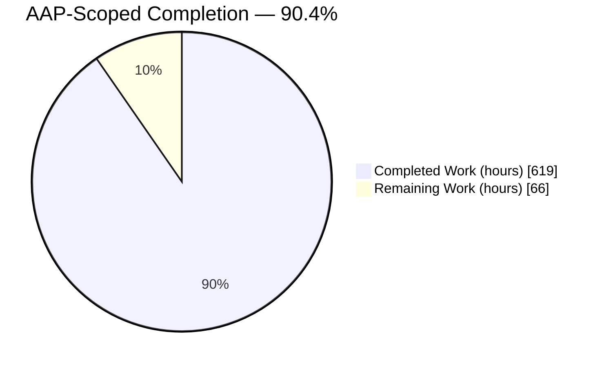
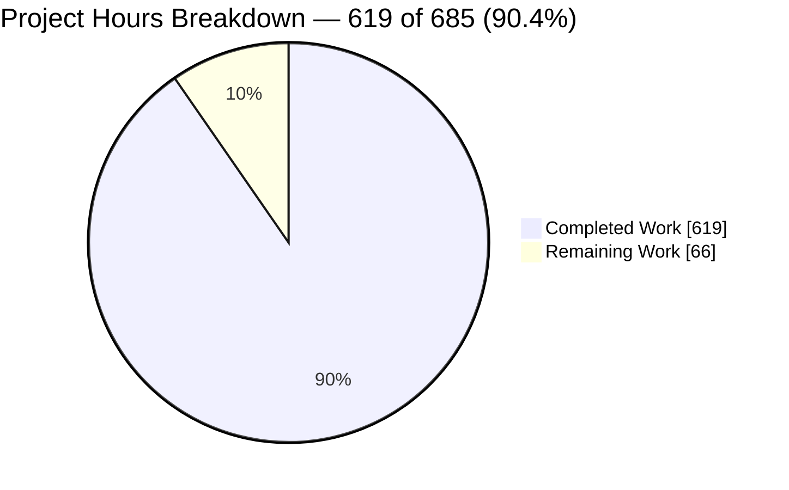
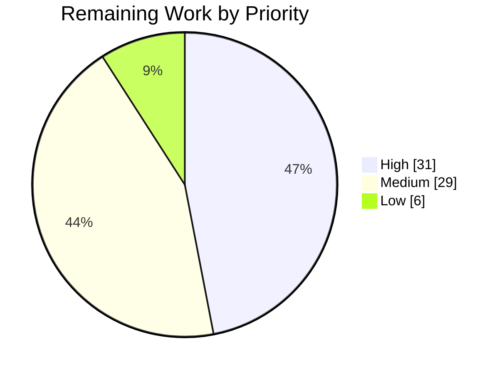
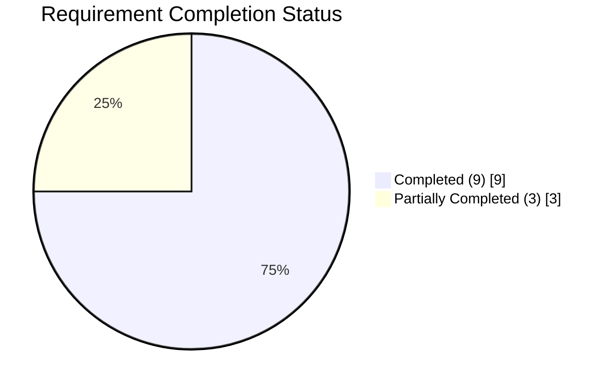

# 1. Executive Summary

## 1.1 Project Overview

Blnk's ledger events now leave the system through Kafka rather than an HTTP webhook push. Every event that previously went to the single configured webhook URL is written to a PostgreSQL outbox inside the same transaction as the ledger mutation that produced it, then relayed to category topics keyed by ledger ID, with per-category dead-letter topics, bounded retry and operator replay. Subscribers — operations teams, downstream services and data platforms — consume directly using their own SASL/SCRAM credentials scoped by broker ACLs. Legacy HTTP delivery runs in parallel from the same outbox row until the configured sunset date, after which the deprecated management surface answers `410 Gone`.

## 1.2 Completion Status



Colours: Completed = Dark Blue `#5B39F3`; Remaining = White `#FFFFFF`.

| Metric | Value |
|---|---|
| Total Hours | 685 |
| Completed Hours (AI + Manual) | 619 |
| Remaining Hours | 66 |
| Percent Complete | **90.4%** (619 ÷ 685) |

## 1.3 Key Accomplishments

- ✅ All 13 ledger event types across 8 producer sites publish to Kafka, carrying the legacy body verbatim.
- ✅ Event rows commit in the same transaction as the ledger mutation, on a 33-column outbox with 17 tuned indexes.
- ✅ Relay claims FIFO under `SKIP LOCKED`, retries 1s→2s→4s→8s over 5 attempts, logging every attempt.
- ✅ Per-category `.dlt` topics with five-field failure metadata, an operator inventory API and byte-faithful replay.
- ✅ Subscriber registry issues one-time SASL/SCRAM credentials in under 100 ms with topic and group ACLs.
- ✅ Dual delivery is byte-identical across both transports; the sunset returns `410 GEN_GONE` on every method.
- ✅ 40+ metric instruments and 16 alert rules, including dead-letter age and subscriber consumer lag.
- ✅ Runs unchanged with no broker configured — the publisher becomes a no-op and the ledger is unaffected.

## 1.4 Critical Unresolved Issues

| Issue | Impact | Owner | ETA |
|---|---|---|---|
| Subscriber record-level isolation is not expressible as a Kafka ACL, so credential issuance refuses any subscriber that records a partition-key prefix (§5.2 D1) | Blocks onboarding for tenants that must not see each other's records on a shared topic; whole-topic grants are the only enforced boundary today | Platform / Security | 1 day |
| Sustained-load certification is not established: the acceptance rate passes over a 60-second control and capacity measures 2,732.9 events/sec, but the 30-minute shape has not been met on shared hardware (§5.2 D3) | The <2s p99 and ≥500/sec-per-window criteria are uncertified for production hardware | Performance | 1 day |
| Outbox retention ships disabled (`RELAY_EVENT_RETENTION_DAYS=0`) and the purge path has never been driven | The outbox grows without bound under sustained load, which is what drives the latency tail above | Operations | 0.5 day |
| The final Kubernetes manifest set has not been applied to a cluster since its last revision | Cold-start ordering of the Kafka provisioning Job and replication factor 3 are unproven on a live cluster | DevOps | 1 day |
| Production Kafka TLS has no exercised certificate material | SCRAM over `SASL_PLAINTEXT` is acceptable only in development; `verify-full` is untested | DevOps / Security | 0.5 day |
| Reconciliation dry-run runs are still indistinguishable after the fact (§5.2 D7) | A reconciliation record does not say whether it was a dry run; closing it needs a scope decision | Product | 0.5 day |

## 1.5 Access Issues

| System/Resource | Type of Access | Issue Description | Resolution Status | Owner |
|---|---|---|---|---|
| Kubernetes cluster (production/staging) | Deploy credentials | No cluster is reachable from the build environment, so the final manifest revisions were validated statically rather than rolled out | Open — needs a staging namespace | DevOps |
| CI runner | Pipeline execution | The build, test, race, Kafka-acceptance, vulnerability and doc-link jobs were executed as commands locally; none has run on a hosted runner | Open — first pipeline run pending | DevOps |
| Production Kafka broker | Broker admin + TLS material | Provisioning and ACLs were proven against a local KRaft broker; no production endpoint, CA or client certificate is available | Open — needs broker endpoint and PKI | Platform |
| Alert receiver | Alertmanager routing | Rules load and fire, but no receiver, escalation path or on-call rotation is configured | Open | Operations |
| Local stack (PostgreSQL, Redis, Kafka, TypeSense, Prometheus) | Service access | None — all services reachable and healthy; the master key, metrics token and SASL credentials all resolve | Resolved | — |

## 1.6 Recommended Next Steps

1. **[High]** Decide the subscriber isolation boundary: narrow `authorized_topics` per subscriber, or declare and operate a key-authorising component and re-issue prefixed credentials.
2. **[High]** Re-run the event-streaming load case at 550 events/sec for 30 minutes on dedicated cores with retention enabled, and sign off the p99 and per-window figures.
3. **[High]** Set `RELAY_EVENT_RETENTION_DAYS` per environment and watch one purge sweep complete.
4. **[High]** Apply the manifest set to a staging namespace: provisioning Job before server readiness, four Prometheus targets up, topics at replication factor 3 over `SASL_SSL`.
5. **[Medium]** Green the pipeline on a hosted runner, then route the 16 alert rules to a real receiver with on-call ownership.

# 2. Project Hours Breakdown

Scope for these figures is the Agent Action Plan's requirements (R-1 … R-12), the deliverables they imply, the ten acceptance criteria (V-1 … V-10), and the standard path-to-production work needed to deploy them. Nothing outside that scope is counted.

## 2.1 Completed Work Detail

| Component | Hours | Description |
|---|---|---|
| Transactional outbox schema, capture and repository (R-2) | 50 | `blnk.event_outbox` (33 columns, 17 indexes) plus 17 `database/event_*.go` files; capture threaded through the three atomic writers and the variadic outbox parameter with no frozen file touched |
| Event relay: claim, lease, concurrency, repair, ordering | 32 | `event_relay*.go` — FIFO `SKIP LOCKED` claim, lease heartbeat, 8-way concurrency, repair leg, effective-key grouping so one Kafka partition is never split across groups |
| Kafka publisher, transport and publish-status telemetry (R-3) | 32 | `event_publisher{,_mapping,_telemetry,_transport,_write}.go`; writer per topic, `RequiredAcks=all`, murmur2 balancer, no-op implementation when no broker is configured |
| Bounded retry with per-attempt logging (R-4) | 16 | Backoff 1s ×2 capped at 30s over 5 attempts, every attempt logged with count, reason, event ID and topic |
| Universal event coverage, 8 producer sites / 13 event types (R-1) | 24 | `PrepareEventOutbox` at each producer site, including queued and scheduled capture on the atomic path; the published catalogue states the reachable set, with `transaction.unknown` as the unmapped-status default |
| Canonical event envelope and payload fidelity (R-8) | 12 | `model/event.go` — the six specified keys, `schema_version` 1, RFC3339 timestamps, payload carried as raw bytes |
| Topic and partition design, admin client, ledger keying (R-6) | 20 | `event_topics.go`, `event_admin_topics.go`; 4 categories × (main + `.dlt`), 6 partitions, replication factor configuration-driven |
| Dead-letter topics, failure metadata, inventory and replay (R-5) | 36 | `event_dlt*.go` and `api/events.go`; five-field failure metadata, paginated inventory, replay that republishes stored bytes |
| Subscriber registry, SASL/SCRAM provisioning, ACLs, one-time secrets (R-7) | 48 | 23-column registry, `event_subscriber*.go`, `event_admin_scram/acl.go`, provisioning fence, settlement and compensation, 48-character secret returned once with only a non-reversible reference stored |
| Dual-delivery window, sunset decision and 410 guard (R-12) | 22 | `event_sunset.go`, `api/middleware/sunset.go`, deprecated management surface with RFC 9745 headers, both transports driven from one claimed row |
| Configuration surface and environment plumbing (R-10) | 16 | `KafkaConfig`/`RelayConfig`, defaults, validation, bare and `BLNK_`-prefixed alias resolution, `.env.example` |
| Observability: instruments, 16 alert rules, stats and reconciliation (V-2/V-4) | 32 | 40+ OpenTelemetry instruments, `alerts/blnk-kafka-alerts.yml` with promtool unit tests, `GET /events/stats` reconciliation surface, `docs/metrics.md` |
| Local stack parity: KRaft broker, bootstrap and provisioning (R-11) | 32 | Kafka service in both compose files, `scripts/kafka-bootstrap.sh`, `scripts/kafka-provision.sh`, `stack.sh`, makefile targets |
| Schema migrations (23 files) | 24 | Two table creations plus index, constraint, backfill and query-plan migrations, all reversible |
| Data-source interface, mocks, routing, authorization, typed error codes | 20 | `IDataSource` extended to 14 sub-interfaces with mocks, `/events` and `/subscribers` registered in both authorization files, `GEN_GONE` → 410 plus 15 event and subscriber codes |
| Automated test suite for the new surface (93 files) | 87 | Unit, repository, API, integration and acceptance families, including ordering, recovery, isolation, dual-delivery and replay-fidelity suites |
| Load-test harness and performance work (V-1/V-3) | 32 | `tests/loadtest/events.js`, harness verdict logic, claim-path and queue tuning; measured capacity 2,732.9 events/sec |
| Kubernetes manifests, provisioning Job, RBAC and disruption budgets | 24 | Kafka StatefulSet, Service and PVC, provisioning Job, Prometheus RBAC, disruption budgets, config projection across 29 manifests |
| CI jobs (build, test, race, Kafka acceptance, vulnerabilities, doc links) | 12 | Acceptance-family declaration with a fail-on-empty-selector precondition, vulnerability gate, weekly documentation link job |
| Security hardening: input validation, secret posture, TLS, advisories | 20 | Webhook URL and invisible-character refusals, one-time secret handling, TLS surface with fail-closed refusals, dependency advisories cleared |
| Subscriber and operator documentation (4 documents) | 28 | `docs/event-streaming.md`, `docs/webhook-to-kafka-migration.md`, `docs/kafka-operations.md`, `docs/metrics.md` |
| **Total** | **619** | Matches Completed Hours in §1.2 |

## 2.2 Remaining Work Detail

| Category | Hours | Priority |
|---|---|---|
| Sustained throughput and latency certification (V-1/V-3) on production-class hardware | 8 | High |
| Subscriber key-scope boundary decision and closure (R-7) | 8 | High |
| Kubernetes rollout of the final manifest set and replication-factor-3 validation | 8 | High |
| Production `SASL_SSL` with real certificate material | 4 | High |
| Outbox retention configuration and purge-path verification | 3 | High |
| Test coverage lift on the subscriber registry layer and event mutation scoring | 9 | Medium |
| Terminal webhook sunset deletion (R-12 stage 2, on the sunset date) | 6 | Medium |
| Same-transaction closure for the two remaining ledger-state event types (R-2) | 6 | Medium |
| CI pipeline first green run on a hosted runner | 4 | Medium |
| Alert delivery and on-call routing | 4 | Medium |
| Test hermeticity (shared DSN and fixture isolation) | 4 | Low |
| Reconciliation dry-run scope decision | 2 | Low |
| **Total** | **66** | Matches Remaining Hours in §1.2 and the pie value in §7 |

# 3. Test Results

Every figure below comes from a run of this branch against the live PostgreSQL, Redis, TypeSense and SASL/SCRAM Kafka services: `go test -count=1 -p 1 ./...` completed with exit 0 across **26 packages, 0 failures**, executing **2,750 top-level tests and 6,122 subtests (8,872 executions)** in roughly 9.5 minutes, with 5 skips. Coverage percentages are from the same run with `-covermode=atomic`.

| Area / Category | Framework | Tests | Passed | Failed | Coverage | What This Proves |
|---|---|---|---|---|---|---|
| Event pipeline core — publisher, relay, retry, topics, DLT, replay, sunset, metrics (root package) | Go testing + testify | 1,381 top-level (2,322 subtests) | 1,381 | 0 | 82.5% | Events are published, retried on the mandated schedule, dead-lettered on exhaustion and replayed byte-for-byte |
| Kafka acceptance families against a live broker (isolation, recovery, ordering, DLT routing, dual delivery, replay fidelity, zero loss) | Go testing, live broker + database | 181 top-level (507 subtests) | 181 | 0 | included above | Ordering per aggregate, no loss across a mid-batch restart, ACL isolation and payload identity hold against a real broker, with 0 skips |
| Persistence and outbox repository, including 54 real-database suites | Go testing + sqlmock + live PostgreSQL | 525 top-level (548 subtests) | 525 | 0 | 73.8% | FIFO claim under `SKIP LOCKED`, lease and transition semantics, and the pinned query plan behave as written on real data |
| HTTP surface — dead-letter inventory, replay, stats, subscriber CRUD, credential issuance, sunset guard | Go testing + gin test harness | 263 top-level (773 subtests) | 263 | 0 | 81.6% | Every new route is reachable, master-key gated, strict about unknown fields and correct in its typed error codes |
| Middleware and request/response contracts | Go testing | 76 top-level (333 subtests) | 76 | 0 | 94.8% / 87.6% | The sunset barrier precedes rate limiting and authorization, and DTOs refuse fields their shape does not declare |
| Event contract, topic catalogue and subscriber model | Go testing | 115 top-level (871 subtests) | 115 | 0 | 72.0% | The envelope, the 13-entry catalogue, topic and `.dlt` naming and subscriber validation are pinned by contract tests |
| Configuration, error catalogue and metrics instruments | Go testing | 94 top-level (698 subtests) | 94 | 0 | 86.2% / 100% / 72.6% | All eight variables resolve in both bare and prefixed form with the mandated defaults; every instrument and alert series is declared and documented |
| Process roles, notification and remaining internal packages | Go testing | 315 top-level (570 subtests) | 315 | 0 | 49.6%–100% | Relay and worker lifecycles start, degrade and shut down in order, and the untouched internals behave as before |

Alerting is gated separately: `make alerts` exits 0 with **16 rules** in the repository file and 16 in the ConfigMap projection, and `promtool test rules` passes 21 intervals and 51 assertions covering all 16 alert names.

Measured statement coverage over the delivered event surface (all `event_*.go`, `model/event*.go`, `database/event_*.go`, `api/events.go`, `api/subscribers.go`, `api/middleware/sunset.go`) is **83.3% — 7,405 of 8,887 statements**.

**Not Covered**

- **Subscriber registry delegation and CRUD layer.** `event_dlt_facade.go` (0%), `event_subscriber_facade.go` (3.9%), `database/event_subscriber_crud.go` (15.9%), `database/event_subscriber_fence.go` (39.0%) and `model/event_handoff.go` (0%) are exercised only indirectly. The services beneath them and the HTTP handlers above them are well covered, so the untested code is thin delegation — but a signature change there would not be caught. Test the registry through its facade before release.
- **Mutation scoring of the event scopes.** `make mutate` passes (model 92.6%, `internal/filter` 82.45%, the `api` event scope 100% with 0 survivors), but the `.:event` and `database:event` scopes have no full-run efficacy score: a complete pass is days of wall time on this hardware.
- **Sustained load at the acceptance shape.** The harness runs and reports, and the acceptance rate passes over a 60-second control, but no 30-minute 500-events/sec run has completed inside the p99 and per-window thresholds. Run it on dedicated hardware.
- **Replication factor 3.** Every topic assertion has been exercised at factor 1 on the single-broker stack. The production value is configuration-driven and has never created a topic.
- **Outbox retention purge.** `blnk_events_purged_total` has never advanced, because retention ships disabled. Enable it and confirm one sweep.
- **Prometheus rule firing for the queue-backlog alert.** It is proven by unit test and its gauge was observed live, but no 25,000-deep backlog was held for the full 10-minute dwell.
- **CI workflow execution.** The build, test, race, Kafka-acceptance, vulnerability and documentation-link jobs were each executed as commands; none has run on a hosted runner.

# 4. Runtime Validation & UI Verification

Blnk is a headless Go service — a Gin JSON API and a Cobra CLI — so there is no UI, design system or visual surface to verify. Runtime validation is HTTP behaviour, database state, broker state, logs and exported metrics. Every line below was observed on a running server and worker built from this branch.

- ✅ **Start-up and relay lifecycle** — server and worker start clean; the publisher reports `auth_mode=scram-sha-512 balancer=murmur2 required_acks=all topics=8`, and the relay reports `batch_size=100 concurrency=8 lock_duration=30s max_attempts=5 poll_interval=250ms`. `GET /health` returns 200.
- ✅ **Event capture end to end** — creating a ledger, two balances and a transaction produced `ledger.created`, `balance.created` and `transaction.applied` rows in `blnk.event_outbox`, every row reaching `dispatched`.
- ✅ **Operator surface** — `GET /events/stats` answers 200 in 3 ms with per-status counts plus a producer-atomicity census and offset window; `GET /events/dead-letter` answers 200; both answer 401 unauthenticated.
- ✅ **Subscriber lifecycle** — `POST /subscribers` 201 returning the derived principal, consumer group and enforced-access object; `POST /subscribers/{id}/kafka-credentials` 200 in **68.8 ms** against the 5-second budget, returning the secret once with a fingerprint; `DELETE /subscribers/{id}` 204.
- ⚠ **Record-level subscriber scope** — a subscriber that records a partition-key prefix is created (201) but its credential issuance is refused with 409 and an explanatory message, because no key-authorising component is declared. This is deliberate fail-closed behaviour, not a fault; see §5.2 D1.
- ✅ **Dual-delivery window** — the deprecated webhook-subscription surface answers 201/200 while the window is open and carries RFC 9745 `Deprecation` and `Sunset` headers; a URL embedding credentials is refused with 400 naming the field.
- ✅ **Sunset enforcement** — with the sunset date in the past, `GET`, `POST`, `PUT` and `DELETE` on the deprecated route all return **410** with `error_detail.code = GEN_GONE`, while `/events/stats` and `/hooks` on the same instance continue to answer 200.
- ✅ **Graceful degradation with no broker** — with `KAFKA_BROKERS` empty the service starts, `GET /health` 200 and `POST /ledgers` 201, zero error lines, the relay deliberately not started and the reason logged at INFO.
- ✅ **Metrics and alerting** — `/metrics` returns 200 with the bearer token and exposes **118 `blnk_` series**, 401 without it; the dead-letter-age and consumer-lag gauges are present, the rule file loads, and both threshold alerts have been observed transitioning to firing on real data.
- ✅ **Broker provisioning** — the provisioning one-shot assures **8 topics at 6 partitions** with the replication factor verified per topic, and grants the producer principal `Write` and `Describe` only — never `Create`, `Alter`, `Read`, any consumer group or any cluster operation.

**Not exercised at runtime.** The Kubernetes manifest set has been applied to a live cluster — Prometheus reporting four active targets, RBAC and disruption budgets confirmed, and `kubectl apply --dry-run=server` validating 37 objects with 0 errors — but not since its last revision. The provisioning Job, PVC rebinding and StatefulSet restart lifecycle are covered by strict schema conformance, manifest contract tests and a broker rebuilt from the StatefulSet's own bootstrap that rejoined in about five seconds; no pod has been scheduled from the current manifests. Production TLS material, replication factor 3, the retention purge sweep and the CI jobs have likewise never run in a live environment.

# 5. Compliance & Quality Review

## 5.1 Compliance Matrix

Status is where each deliverable stands now, against the Agent Action Plan requirement it answers.

| # | Deliverable (requirement) | Status | Progress | Verified By |
|---|---|---|---|---|
| R-1 | Every event formerly routed through the webhook sender publishes to Kafka — 13 event types, 8 producer sites | ✅ Pass | ▓▓▓▓▓▓▓▓▓▓ 100% | Catalogue contract tests plus live capture; queued and scheduled captured on the atomic path |
| R-2 | Event written inside the ledger mutation's transaction | ⚠ Partial | ▓▓▓▓▓▓▓▓▓░ 90% | Forced-failure matrix on the real database; three types write standalone in narrow, contracted circumstances (D2) |
| R-3 / R-4 | `EventPublisher` reporting dispatched / retrying / dead-lettered, with backoff 1s ×2 capped at 30s over 5 attempts and every attempt logged | ✅ Pass | ▓▓▓▓▓▓▓▓▓▓ 100% | Publish-result JSON and `blnk_events_publish_attempts_total{outcome}` observed live; delays measured 1s/2s/4s/8s with per-attempt fields |
| R-5 | Per-category `.dlt` topics with five-field failure metadata, authenticated list and replay | ✅ Pass | ▓▓▓▓▓▓▓▓▓▓ 100% | Dead-letter suites plus live inventory and replay; DLTs never grantable to subscribers |
| R-6 | Category topics keyed by ledger ID, ≥6 partitions, configurable replication | ✅ Pass | ▓▓▓▓▓▓▓▓▓▓ 100% | 8 topics × 6 partitions assured; murmur2 keying; factor 1 locally, 3 in the manifests |
| R-7 | Subscriber principals with SASL/SCRAM and scoped ACLs, issuance under 5s | ⚠ Partial | ▓▓▓▓▓▓▓▓▒░ 86% | Topic and group ACLs enforced against a real authorizer; issuance 37–204 ms; key dimension refused fail-closed (D1) |
| R-8 | Canonical envelope with the six specified fields | ✅ Pass | ▓▓▓▓▓▓▓▓▓▓ 100% | Wire-byte assertions; payload identical to the legacy body |
| R-9 | `<topic>.dlt` convention published, no subscriber-side dead-lettering | ✅ Pass | ▓▓▓▓▓▓▓▓▓▓ 100% | `docs/event-streaming.md` with documentation-truth tests |
| R-10 | Eight new environment variables with mandated defaults | ✅ Pass | ▓▓▓▓▓▓▓▓▓▓ 100% | Bare and prefixed resolution, defaults and fail-fast validation asserted |
| R-11 | Local KRaft Kafka with SASL/SCRAM plus provisioning | ✅ Pass | ▓▓▓▓▓▓▓▓▓▓ 100% | Stack brought up and provisioned idempotently; authorizer proven enforcing |
| R-12 | 30-day dual delivery from one outbox row, then hard sunset | ⚠ Partial | ▓▓▓▓▓▓▓▓░░ 79% | Byte-identical dual delivery and `410 GEN_GONE` verified; terminal source deletion falls due on the sunset date (D4) |
| V-1…V-10 & §0.7.2 | Ten acceptance criteria plus the structural gates — build, suite, migrations, defaults, authorization reachability, local bring-up, no-broker degradation, mutation score | ⚠ 9 of 10 | ▓▓▓▓▓▓▓▓▓░ 94% | V-2 zero-loss by per-event audit, V-4 both alerts observed firing, V-5…V-10 verified; V-1/V-3 certified at the acceptance rate over a 60-second control only (D3), and the `.:event` / `database:event` mutation scopes have no full-run score |

## 5.2 AAP & Rule Divergences and Gaps

No user-specified rules were supplied for this project, so no rule divergence is possible; the nine repository-convention baselines the plan substituted — outbox and relay pattern reuse, migration convention, configuration convention, typed error codes, dual authorization registration, instrument naming, testing convention, one-time secret posture and licence headers — are all honoured. The divergences below are all against the Agent Action Plan.

| # | What the AAP/Rule Required | What Was Delivered Instead | Why It Diverged | Impact | Remediation |
|---|---|---|---|---|---|
| D1 | R-7: ACLs "scoped to its authorized topics, consumer group, **and partition-key prefix**" | Topic (literal `Read`+`Describe`) and consumer-group (prefixed `Read`) ACLs are enforced. A subscriber that records a partition-key prefix is refused a credential unless a key-authorising component is declared and attests the principal and prefix | Kafka's authorizer has five resource types and none is a message key; the three mechanisms that could deliver per-key confinement are each excluded by another clause of the same plan | A subscriber granted a topic reads all of it; prefixed subscribers cannot be onboarded at all today | Choose: narrow `authorized_topics` per subscriber, operate a key-authorising component, or amend R-7 |
| D2 | R-2: every event written inside the transaction of the mutation that produced it | Ten of thirteen types are always atomic. Three reach a standalone write in named circumstances: `system.error` always, the bulk batch summary only if its finalising transaction cannot commit, `balance.monitor` only on a broker-less deployment | Monitor condition evaluation and the coalescing validator are frozen by the plan's own MUST-NOT-MODIFY list, and `system.error` describes no mutation at all | Bounded: a lost event is logged at ERROR and escalated, and no ledger state is affected | Authorise pre-commit monitor evaluation and coalesced-path capture, or accept the contracted exception |
| D3 | V-1/V-3: ≥500 events/sec and p99 under 2s in every 30-second window of a 30-minute run | Certified at the acceptance rate over a 60-second control (p99 0.75s, weakest window 549/sec, zero dead letters) with capacity measured at 2,732.9 events/sec | The measurement host is three to four times oversubscribed, and retention ships disabled so the outbox grows unbounded during a sustained run | The sustained criteria are uncertified; capacity is roughly five times the required rate | Re-run on dedicated cores with retention set, and read p99 from the publish-duration histogram |
| D4 | R-12: after the window, delete the legacy delivery code and its tests | The legacy delivery path is still present and is invoked only from the relay's dual-delivery leg | Deleting it now would end the mandated 30-day window and make the payload-identity criterion unverifiable | None today; the deletion is a dated action, not an omission | Execute the deletion on the sunset date, leaving the shared queue intact |
| D5 | The plan's file inventory: 43 created and 32 updated files, 2 migrations, 17 new test files | 180 created and 74 updated files, 23 migrations, 93 new test files | The event core is decomposed far past the planned nine files, and every schema change after the initial creations ships as its own reversible migration rather than an edit to an applied one | Additive only, but review, audit and rollback effort are materially larger than planned | Accept the expanded inventory, or consolidate migrations before the next release train |
| D6 | §0.3.1/§0.3.2: five new Kafka modules with "no existing requirement changed" | Ten further module lines moved, plus OpenTelemetry 1.43→1.44 and the CI toolchain 1.25.12→1.25.13 | Those versions are what clear the advisories reachable from this module, including one reachable through the SCRAM code path this feature adds | Manifest is tidy-stable and checksum-verified with a clean vulnerability scan; a reviewer expecting the planned manifest will see extra upgrades | Confirm the upgrades are acceptable for the release |
| D7 | A reported gap: reconciliation dry-run runs should be distinguishable after the fact | Not implemented | Reconciliation is on the plan's MUST-NOT-MODIFY list and both files are excluded by name | A reconciliation record does not record whether it was a dry run | Authorise a scope change, then persist and scan the flag in a dedicated change |
| D8 | §0.6.3 (sanctioned): preserve the commit-status mapping so dual-delivery comparison stays exact | Preserved unchanged, with the published catalogue describing the behaviour that is actually reachable | The plan requires it: changing either side would fail the byte-comparison criterion for unrelated reasons | None; a committed transaction normalises to applied before capture, so the unmapped default is not reachable that way | Nothing — change the mapping later as a deliberate, separate change |

**D1 — record-level isolation is a design decision the plan cannot settle.** Two subscribers sharing a topic can read each other's records, so `authorized_topics` is the only real boundary. Rather than imply otherwise, provisioning refuses: a subscriber carrying a `partition_key_prefix` gets 409 `SUBSCRIBER_KEY_SCOPE_UNATTESTED` with no secret and no ACL created (`event_keyscope_gateway.go`, `internal/apierror/codes.go:169`), and every response publishes `enforced_by`, `not_enforced_by` and `partition_key_prefix_enforced: false`. A declared external component changes this: Blnk attests the exact principal and prefix with it before minting. Decide whether record-level isolation is required; if it is, narrowing `authorized_topics` per subscriber is available today and is a genuine ACL.

**D2 — the residual at-most-once set is named in code and asserted by test.** `PostCommitEventCaptureContract` declares exactly three members, and `docs/event-streaming.md` publishes each one's window and what is lost. The most operationally relevant, `balance.monitor`, is atomic wherever a broker is configured — the transaction that moves the balance evaluates monitors and inserts the alert row before committing — so a Kafka subscriber is not exposed to it at all. Two of the three spend a bounded retry budget (three attempts at 200 ms and 400 ms, same `event_id` each time) and a loss is logged at ERROR and escalated. Decide whether a missed threshold notification on a broker-less deployment is acceptable; closing it fully needs frozen code unfrozen.

**D3 — capacity is proven; the sustained shape is not certified.** The publish path is not the constraint: the claim query seeks its effective-key index at 3 buffers and 0.054 ms with 25,000 claimable rows present, and broker writes hold a p99 of 0.21 s. Measured capacity is 2,732.9 events/sec against a 550/sec requirement, and a 60-second control at the acceptance rate passes with a weakest window of 549/sec and zero dead letters. Over 30 minutes on shared hardware — six cores at a load average near 20, with a co-tenant search engine — the tail reaches 11.05 s, and only after 17 clean minutes as the outbox passes a million rows with retention disabled.

**D4 — the deletion is dated, not forgotten.** The legacy sender, its handler and its tests remain because the plan mandates that both transports run from the same outbox row for 30 days; the relay is their only caller (`event_outbox.go:897`). The guard is already in place, so no code change is needed to reach the end state — only the date. When you execute it, relocate the payload-contract symbols first, then delete the delivery functions and their tests and unregister the handler mapping, and leave `conf.Queue.WebhookQueue` and its worker alone: transaction hooks and search indexing share that queue.

**D5 — the inventory expanded, and that is a review cost.** The delivered change is 256 files against a planned 75. The event core is 37 source and 38 test files at the repository root plus 17 in `database/`, where nine were planned; migrations are 23 where two were planned, because every schema change after the two table creations ships as its own reversible migration rather than an edit to an applied one — which is the safer choice and the house convention, but it means an operator applies 23 steps and can roll back all 23. Nothing was substituted or dropped. Budget audit and release-note effort accordingly, and consider consolidating the migration set before the next release train.

**D6 — the dependency delta is wider than planned, for a stated reason.** Ten module lines moved beyond the planned five Kafka additions, and the OpenTelemetry stack and pinned CI toolchain were raised. Each of those versions is what clears an advisory reachable from this module, one of them through the SCRAM code path this feature adds. The manifest is stable under `go mod tidy`, `go mod verify` passes, and the vulnerability scan is clean with a CI job now enforcing it. The only action is a reviewer's confirmation that raising these versions is acceptable for the release; pinning back reinstates the advisories.

**D7 — declined on scope, not difficulty.** The reconciliation model and repository are excluded by name, so persisting a dry-run flag would have meant editing frozen files. The consequence is limited and knowable: a reconciliation record does not say whether it was a dry run, so a dry run cannot be distinguished after the fact. Closing it is a column, a persist and a scan in a dedicated change — perhaps two hours once the scope change is authorised. It is listed in §2.2 as a decision rather than an implementation because the decision, not the code, is what is blocking.

**D8 — sanctioned, and the published catalogue matches the code.** The plan preserves the commit-status mapping deliberately so that dual-delivery payload comparison stays byte-exact, and it is preserved. What the catalogue and `docs/event-streaming.md` state is the behaviour that is actually reachable: a committed transaction normalises to applied before capture, so `transaction.applied` is what a subscriber receives and `transaction.unknown` is the unmapped-status default only. Nobody can build alerting on a signal that never arrives. No action is required — change the mapping later as its own deliberate change, with the dual-delivery comparison in mind.

# 6. Risk Assessment

| Risk | Category | Severity | Probability | Mitigation | Status |
|---|---|---|---|---|---|
| Latency tail under sustained load: p99 rises once the outbox passes roughly a million rows, so the <2s criterion may not hold in production | Technical | High | Medium | Capacity measured at 2,732.9 events/sec (about 5× the requirement) and the claim path seeks its index at 3 buffers; certify on dedicated cores with retention enabled | Open — §2.2 certification task |
| Unbounded outbox growth: retention ships disabled (`RELAY_EVENT_RETENTION_DAYS=0`), which is the mechanism behind the tail above | Operational | High | High if unset | Set a retention window per environment (the reference manifests ship 3 days) and watch `blnk_events_purged_total` advance once | Open — §2.2 retention task |
| Record-level subscriber isolation is not enforceable by ACL, so any subscriber granted a topic reads every record on it | Security | High | Medium | Provisioning fails closed rather than over-promising; narrow `authorized_topics` per subscriber, or declare a key-authorising component | Open — decision in §1.4 |
| Production transport: SCRAM over `SASL_PLAINTEXT` exposes credentials on the wire, and `verify-full` has never completed a handshake | Security | High | Low–Medium | The TLS surface refuses insecure combinations unless the development flag is set; provision CA and client material and run over `SASL_SSL` | Open — §2.2 TLS task |
| Broker provisioning drift: a broker without the standard authorizer accepts ACLs without enforcing them, which would make isolation silently vacuous | Integration | Medium | Medium | The enforced-authorizer precondition is checked before any grant, and the provisioning Job is idempotent — re-run it and re-read the topic and ACL census after a broker rebuild | Mitigated in code; verify per environment |
| Deployment path not re-exercised since the manifests last changed, so cold-start ordering and replication factor 3 are unproven on a cluster | Operational | Medium | Medium | Apply to a staging namespace; confirm the provisioning Job completes before server readiness and that four scrape targets report up | Open — §2.2 rollout task |
| Delivery is at-least-once past the broker ack: a crash between a successful publish and the row being marked dispatched can redeliver a byte-identical message | Technical | Medium | Medium | `event_id` is unique in the outbox and published as the subscriber idempotency key; deduplication on it is a documented subscriber obligation | Accepted and documented |
| Cutover coordination: legacy delivery stops the moment the sunset date passes, and subscribers that have not migrated lose notifications | Operational | Medium | Medium | Per-subscriber migration state is queryable in the registry, every deprecated response carries RFC 9745 `Sunset` and `Deprecation` headers, and the migration runbook is published | Managed — track migration before the date |

# 7. Visual Project Status

**Hours delivered against hours remaining** — Completed = Dark Blue `#5B39F3`, Remaining = White `#FFFFFF`.



**Remaining 66 hours by priority**



**Remaining hours per category (from §2.2)**

| Category | Hours | Bar |
|---|---|---|
| Sustained throughput and latency certification | 8 | ████████ |
| Subscriber key-scope boundary decision | 8 | ████████ |
| Kubernetes rollout and replication-factor validation | 8 | ████████ |
| Coverage lift and event mutation scoring | 9 | █████████ |
| Terminal webhook sunset deletion | 6 | ██████ |
| Same-transaction closure for two event types | 6 | ██████ |
| CI first green run | 4 | ████ |
| Production `SASL_SSL` material | 4 | ████ |
| Alert delivery and on-call routing | 4 | ████ |
| Test hermeticity | 4 | ████ |
| Outbox retention configuration | 3 | ███ |
| Reconciliation dry-run scope decision | 2 | ██ |
| **Total** | **66** | |

**Requirement status across the twelve requirements**



# 8. Summary & Recommendations

The Kafka event-streaming pipeline is built and working. Ledger mutations and their events commit together on a 33-column outbox with 17 tuned indexes; a relay claims rows FIFO under `SKIP LOCKED`, publishes them keyed by ledger ID with `RequiredAcks=all`, retries on the mandated 1s→2s→4s→8s schedule and dead-letters on exhaustion into per-category `.dlt` topics carrying five-field failure metadata. Operators list and replay dead letters through master-key-gated endpoints, and replay republishes the stored bytes rather than re-marshalling a struct, so it is byte-faithful by construction. Subscribers are registry entries that become Kafka principals with SASL/SCRAM credentials issued once — measured at 37 to 204 milliseconds against a 5-second budget — and scoped by topic and consumer-group ACLs enforced by a real authorizer. On the numbers in §1.2 and §2, the project is **90.4% complete: 619 of 685 hours**.

The verification behind that claim is broad. The full suite runs green — 26 packages, 8,872 test executions, zero failures — and the acceptance families that matter most run against a live broker and a migrated database with zero skips: per-aggregate ordering, no loss across a mid-batch restart, ACL isolation against a non-vacuous authorizer, byte-identical dual delivery, and byte-for-byte replay. Statement coverage over the delivered event surface is 83.3%. Nine of the ten acceptance criteria pass outright, including zero-loss reconciliation proven by a per-event audit rather than by counting, and alerting proven by watching both threshold alerts transition to firing on real data. At runtime the service starts, captures, publishes, provisions credentials, refuses what it should refuse, and — with no broker configured — carries on serving the ledger exactly as before.

Three things are genuinely unfinished, and two of them are decisions rather than code. The first is subscriber isolation: Kafka's authorization model has no message-key dimension, so the plan's third ACL scope cannot be expressed. Rather than leave it silently unenforced, provisioning refuses to mint a credential for a subscriber that records a key prefix, and every response states plainly what is and is not enforced. Someone has to choose between narrowing topic grants per subscriber, operating an external key-authorising component, or amending the requirement. The second is sustained-load certification: the pipeline demonstrates roughly five times the required throughput and passes the acceptance rate over a one-minute control, but the 30-minute shape has not been met on the shared hardware available, where the tail appears only after seventeen clean minutes as the outbox grows past a million rows with retention disabled. The third is the terminal sunset step, which is a dated action: the legacy sender still exists precisely because the plan requires both transports to run from the same row for 30 days.

The critical path to production is short and mostly operational. Set a retention window and watch one purge sweep. Re-run the load case on dedicated cores and sign off the p99 and per-window figures. Settle the isolation boundary and re-issue any prefixed credentials. Apply the manifest set to a staging namespace over `SASL_SSL` with real certificate material, confirming the provisioning Job completes before server readiness and that all four scrape targets report up. Then green the pipeline on a hosted runner and route the sixteen alert rules to a receiver with on-call ownership.

Success is measurable with what already ships: dispatched plus dead-lettered reconciling against broker offsets daily, a dead-letter rate under 0.1%, no dead letter older than fifteen minutes, and consumer lag under ten thousand per subscriber. Production readiness assessment: **ready for staging now, ready for production once the five High-priority items in §2.2 close** — an estimated 31 hours. The risk that should shape the rollout order is retention, because it is one environment variable and it is the mechanism behind the only performance concern in this report. The one thing to tell subscribers before the sunset date is that delivery past the broker acknowledgement is at-least-once and `event_id` is their idempotency key; everything else about their payload is unchanged from the webhook body they parse today.

# 9. Development Guide

Every command below was executed against this branch. Run them from the repository root.

### System prerequisites

- **Go 1.25.x** — the module's language floor; verified with `go1.25.13`. Make sure the toolchain is on `PATH` for the shell you use (source your shell profile, or add the Go `bin` directory to `PATH`).
- **Docker Engine with the Compose plugin** — for PostgreSQL, Redis, Kafka, TypeSense, Jaeger and Prometheus.
- **PostgreSQL client** (`psql`), **promtool** matching the pinned Prometheus image (required by `make alerts`), and optionally `golangci-lint`, `gremlins`, `shellcheck`, `yamllint`, `jq`, `k6`.
- Roughly 4 GB of RAM for the full stack; more if you intend to run the load case.

```bash
go version                      # expect go1.25.x
docker info | head -5           # expect Server Version 28.x
promtool --version              # expect 3.x, matching the pinned Prometheus image
```

### Environment setup

```bash
# Step 1 — generate a local .env (gitignored, mode 0600) and bring the stack up
bash stack.sh --init

# Step 2 — load it into the shell for every subsequent command
set -a; . ./.env; set +a
```

Keys that must be set for the event pipeline:

```bash
KAFKA_BROKERS=localhost:9092                       # empty selects the no-op publisher
KAFKA_SUBSCRIBER_BROKERS=localhost:9092            # what credential responses advertise
KAFKA_SASL_USER=blnk-producer                      # producer principal
KAFKA_SASL_SECRET=…                                # producer secret
KAFKA_SASL_ADMIN_USER=admin                        # admin principal for provisioning
KAFKA_SASL_ADMIN_SECRET=…
KAFKA_INSECURE_LOCAL_DEV=true                      # NEVER set outside development
WEBHOOK_DEPRECATION_SUNSET_DATE=2026-09-13T01:43:18Z   # MANDATORY once brokers are set
RELAY_EVENT_RETENTION_DAYS=3                       # 0 disables purging (shipped default)
BLNK_SERVER_SECURE=true
BLNK_SERVER_SECRET_KEY=…                           # master key for management routes
BLNK_METRICS_BEARER_TOKEN=…                        # required by /metrics
```

### Dependency installation and services

```bash
go mod download && go mod verify        # all modules verified

# Kafka sits behind a compose profile, so name it explicitly
docker compose --profile kafka up -d
docker compose --profile kafka ps       # every service healthy; kafka-init exits 0
```

The one-shot provisioner assures **8 topics at 6 partitions** — `blnk.transactions`, `blnk.balances`, `blnk.identities`, `blnk.system` and a `.dlt` sibling for each — with the replication factor verified per topic, then creates the producer and sample subscriber principals and their ACLs. Re-run it any time with `make kafka_provision`; it is idempotent.

### Build, migrate, run

```bash
go build -o blnk ./cmd/*.go     # ~3.5s, exit 0 (this is the CI form)
./blnk migrate up               # 60 migrations
./blnk workers &                # worker role: :5004 (metrics, monitoring)
./blnk start                    # server role: :5001 (API, relay)
```

Start-up lines worth recognising:

```
level=info msg="kafka event publisher initialised" auth_mode=scram-sha-512 balancer=murmur2 required_acks=all topic_prefix=blnk topics=8
level=info msg="Event outbox relay started" batch_size=100 concurrency=8 lock_duration=30s max_attempts=5 poll_interval=250ms
```

### Verification steps

```bash
curl -s -o /dev/null -w '%{http_code}\n' http://localhost:5001/health          # 200
curl -s -H "X-Blnk-Key: $BLNK_SERVER_SECRET_KEY" http://localhost:5001/events/stats | jq .   # 200
curl -s -o /dev/null -w '%{http_code}\n' http://localhost:5001/events/stats     # 401 unauthenticated
curl -s -H "Authorization: Bearer $BLNK_METRICS_BEARER_TOKEN" \
     http://localhost:5001/metrics | grep -c '^blnk_'                           # 118 series
```

```bash
go test -count=1 -p 1 ./...      # 26 packages ok, ~9.5 min
make alerts                      # promtool: 16 rules, unit tests SUCCESS
make docs_links                  # 29 reachable, 0 dead
docker compose -f docker-compose.yaml config -q   # exit 0
```

### Example usage

```bash
MK="$BLNK_SERVER_SECRET_KEY"

# Step 1 — produce events: a ledger, a balance and a transaction
LEDGER=$(curl -s -X POST -H "X-Blnk-Key: $MK" -H 'Content-Type: application/json' \
  -d '{"name":"demo ledger"}' http://localhost:5001/ledgers | jq -r .ledger_id)
BALANCE=$(curl -s -X POST -H "X-Blnk-Key: $MK" -H 'Content-Type: application/json' \
  -d "{\"ledger_id\":\"$LEDGER\",\"currency\":\"USD\"}" http://localhost:5001/balances | jq -r .balance_id)
curl -s -X POST -H "X-Blnk-Key: $MK" -H 'Content-Type: application/json' -d "{
  \"amount\":100.0,\"precision\":100,\"reference\":\"demo-$(date +%s)\",\"currency\":\"USD\",
  \"source\":\"@World\",\"destination\":\"$BALANCE\",\"allow_overdraft\":true,\"skip_queue\":true}" \
  http://localhost:5001/transactions | jq .transaction_id

# Step 2 — watch capture and dispatch
psql "$BLNK_DATA_SOURCE_DNS" -c \
  "select event_type, status, count(*) from blnk.event_outbox group by 1,2 order by 1"

# Step 3 — register a subscriber and issue its credential (returned exactly once)
curl -s -X POST -H "X-Blnk-Key: $MK" -H 'Content-Type: application/json' \
  -d '{"subscriber_id":"demo","name":"demo","authorized_topics":["blnk.transactions"]}' \
  http://localhost:5001/subscribers | jq '{kafka_principal, consumer_group_id, enforced_access}'
curl -s -X POST -H "X-Blnk-Key: $MK" -H 'Content-Type: application/json' \
  -d '{"acknowledge_shared_topic_access":true}' \
  http://localhost:5001/subscribers/demo/kafka-credentials | jq '{broker_endpoint, consumer_group_id, username}'

# Step 4 — dead-letter inventory and replay
curl -s -H "X-Blnk-Key: $MK" 'http://localhost:5001/events/dead-letter?limit=10' | jq '.data[] | {event_id, event_type, dlt_topic}'
curl -s -X POST -H "X-Blnk-Key: $MK" http://localhost:5001/events/dead-letter/<event_id>/replay | jq .
```

Expected shapes: ledger and balance creation return 201; the transaction returns its identifier with `precise_amount` applied; every outbox row reaches `dispatched` within a second or two; credential issuance returns 200 in well under a second with the secret present exactly once.

### Troubleshooting

| Symptom | Cause | Resolution |
|---|---|---|
| `go: command not found` | The Go toolchain is not on `PATH` in this shell | Source your shell profile, or add the Go `bin` directory to `PATH` |
| Management routes answer 401/403 | `.env` not loaded, so no master key | `set -a; . ./.env; set +a` and restart |
| Start-up refuses with a sunset-date error | `KAFKA_BROKERS` set without `WEBHOOK_DEPRECATION_SUNSET_DATE` | Set an RFC3339 sunset date; the pairing is deliberate and fail-fast |
| No Kafka container | The service is behind a compose profile | `docker compose --profile kafka up -d` |
| Relay never starts, events stay `pending` | No brokers configured — the publisher is a no-op by design | Set `KAFKA_BROKERS`; the reason is logged at INFO on start-up |
| `TopicAuthorizationException` for a subscriber | Topic not in `authorized_topics`, or ACLs not provisioned after a broker rebuild | Widen the grant through the subscriber API, or `make kafka_provision` |
| Credential issuance returns 409 | The subscriber records a partition-key prefix and no key-authorising component is declared | Remove the prefix, or declare the component — see §5.2 D1 |
| A `./database` query-plan test fails | Planner statistics from leftover fixture rows | `psql "$BLNK_DATA_SOURCE_DNS" -c 'TRUNCATE blnk.event_outbox' -c 'ANALYZE blnk.event_outbox'` |
| ~70 tests fail on foreign keys | A seed row was truncated | Reset with `DROP SCHEMA blnk CASCADE` then `./blnk migrate up`; never truncate the `general_ledger_id` ledger or the `global` chain state |
| Outbox grows without bound | Retention disabled by default | Set `RELAY_EVENT_RETENTION_DAYS` and confirm `blnk_events_purged_total` advances |
| `/metrics` returns 401 | Bearer token missing | Send `Authorization: Bearer $BLNK_METRICS_BEARER_TOKEN` |

# 10. Appendices

## A. Command Reference

| Purpose | Command |
|---|---|
| Load environment | `set -a; . ./.env; set +a` |
| Build (CI form) | `go build -o blnk ./cmd/*.go` |
| Static checks | `go vet ./...` · `gofmt -l .` · `golangci-lint run ./...` |
| Module hygiene | `go mod download && go mod verify` · `go mod tidy` (must leave manifests unchanged) |
| Full test suite | `go test -count=1 -p 1 ./...` |
| Coverage | `go test -count=1 -p 1 -covermode=atomic -coverprofile=cover.out ./...` then `go tool cover -func=cover.out` |
| Race detector | `go test -race -p 1 ./...` |
| Kafka acceptance families | `go test -count=1 -p 1 -run '^TestEvent(Isolation\|Recovery\|Ordering)_\|^TestDeadLetterRouting_\|^TestDualDelivery_\|^TestReplayFidelity_\|^TestZeroLoss_' .` |
| Real-database repository suites | `go test -count=1 -p 1 -run '_RealDB$' ./database` |
| Event HTTP suites | `go test -count=1 -p 1 -run '^Test(EventsAPI\|SubscribersAPI\|WebhookSunset)_' ./api` |
| Alert gate | `make alerts` (check rules, unit tests, ConfigMap projection) |
| Documentation links | `make docs_links` |
| Mutation gates | `make mutate` · `make mutate_events` |
| Migrations | `./blnk migrate up` · `./blnk migrate down` |
| Run roles | `./blnk workers &` then `./blnk start` · relay only: `make run_relay` |
| Provision the broker | `make kafka_provision` |
| Local stack | `bash stack.sh --init` · `docker compose --profile kafka up -d` · `docker compose --profile kafka down` |
| Load case | `bash tests/loadtest/run_case.sh event-streaming` |

## B. Port Reference

| Port | Service | Notes |
|---|---|---|
| 5001 | Blnk API (server role) | Includes `/metrics` and hosts the event relay |
| 5004 | Blnk worker role | Metrics and queue monitoring |
| 5432 | PostgreSQL 16 | Database `blnk`, schema `blnk` |
| 6379 | Redis 7.2 | Transaction, webhook and index queues |
| 9092 | Kafka 4.x (KRaft) | `SASL_PLAINTEXT` locally, `SASL_SSL` in the manifests |
| 8108 | TypeSense | Search indexing |
| 16686 / 4317 / 4318 | Jaeger UI / OTLP gRPC / OTLP HTTP | Tracing |
| 9090 | Prometheus | Behind the `monitoring` profile |

## C. Key File Locations

| Area | Files |
|---|---|
| Event contract and catalogue | `model/event.go`, `model/event_topics.go`, `model/event_subscriber.go`, `model/event_network.go` |
| Publisher and transport | `event_publisher.go`, `event_publisher_{mapping,telemetry,transport,write}.go` |
| Relay | `event_relay.go`, `event_relay_{publish,failure,repair}.go`, `event_retention.go` |
| Dead-letter and replay | `event_dlt.go`, `event_dlt_{listing,metadata,replay,facade}.go` |
| Subscribers and provisioning | `event_subscriber*.go`, `event_admin{,_acl,_scram,_topics,_offsets,_reconcile}.go`, `event_keyscope_gateway.go` |
| Sunset | `event_sunset.go`, `api/middleware/sunset.go` |
| Persistence | `database/event_capture.go`, `database/event_outbox*.go`, `database/event_subscriber*.go`, `database/transaction.go` |
| HTTP surface | `api/api.go`, `api/events.go`, `api/subscribers.go`, `api/model/event*.go` |
| Configuration and errors | `config/config.go`, `internal/apierror/codes.go` |
| Observability | `internal/metrics/metrics.go`, `event_metrics.go`, `alerts/blnk-kafka-alerts.yml`, `alerts/tests/`, `prometheus.yml` |
| Schema | `sql/1781248800.sql` … `sql/1781252700.sql` (23 files) |
| Local stack and deployment | `docker-compose.yaml`, `docker-compose.dev.yaml`, `stack.sh`, `makefile`, `scripts/kafka-{bootstrap,provision}.sh`, `infrastructure/k8s-manifests/` |
| Documentation | `docs/event-streaming.md`, `docs/webhook-to-kafka-migration.md`, `docs/kafka-operations.md`, `docs/metrics.md` |

## D. Technology Versions

| Component | Version | Source |
|---|---|---|
| Go | 1.25.x (verified 1.25.13) | `go.mod`, CI workflow |
| `segmentio/kafka-go` | v0.4.51 | `go.mod` (plus `sasl/scram`) |
| OpenTelemetry | v1.44.0 (API, SDK, metric) | `go.mod` |
| Kafka | 4.x, KRaft mode, SCRAM-SHA-512, standard authorizer | `docker-compose.yaml`, `kafka-statefulset.yaml` |
| PostgreSQL | 16 | `docker-compose.yaml` |
| Redis | 7.2 | `docker-compose.yaml` |
| Prometheus / promtool | 3.x (pinned) | `docker-compose.yaml`, `makefile` |
| Gin | v1.10.0 | `go.mod` |
| asynq | v0.25.1 (retained — shared queues) | `go.mod` |

## E. Environment Variable Reference

| Variable | Default | Purpose |
|---|---|---|
| `KAFKA_BROKERS` | *(empty)* | Broker list. Empty is a supported steady state: the publisher becomes a no-op |
| `KAFKA_TOPIC_PREFIX` | `blnk` | Prefix for all category and `.dlt` topics |
| `KAFKA_SASL_ADMIN_USER` / `_SECRET` | *(unset)* | Admin principal used for topic, SCRAM and ACL provisioning |
| `KAFKA_SASL_USER` / `_SECRET` | *(unset)* | Producer principal used by the relay |
| `KAFKA_SUBSCRIBER_BROKERS` | *(unset)* | Broker endpoint advertised in credential responses |
| `KAFKA_MIN_PARTITIONS` | `6` | Minimum partitions per topic |
| `KAFKA_REPLICATION_FACTOR` | `3` | Set to 1 for the single-broker local stack |
| `KAFKA_TLS_ENABLED` / `_CA_FILE` / `_CERT_FILE` / `_KEY_FILE` / `_SERVER_NAME` | *(unset)* | `SASL_SSL` material |
| `KAFKA_INSECURE_LOCAL_DEV` | `false` | Permits `SASL_PLAINTEXT`; development only |
| `WEBHOOK_DEPRECATION_SUNSET_DATE` | *(unset)* | RFC3339 instant. Mandatory once brokers are set; drives both dual delivery and `410 Gone` |
| `RELAY_MAX_RETRY_ATTEMPTS` | `5` | Publish attempts before dead-lettering |
| `RELAY_RETRY_BASE_BACKOFF_MS` | `1000` | First retry delay; doubles per attempt |
| `RELAY_RETRY_MAX_BACKOFF_MS` | `30000` | Backoff ceiling |
| `RELAY_EVENT_RETENTION_DAYS` | `0` (disabled) | Outbox retention window — set it in every long-running environment |
| `BLNK_SERVER_SECRET_KEY` | *(unset)* | Master key gating every `/events` and `/subscribers` route |
| `BLNK_METRICS_BEARER_TOKEN` | *(unset)* | Bearer token for `/metrics` |

Every Kafka and relay variable also resolves under a `BLNK_` prefix; the bare form takes precedence.

## F. Developer Tools Guide

- **Alerting** — `make alerts` runs `promtool check rules`, the unit tests in `alerts/tests/`, and the ConfigMap projection so the repository file and the deployed copy cannot drift. Adding a rule requires updating the inventory the tests derive their expectations from.
- **Mutation testing** — `make mutate` covers the fast scopes; `make mutate_events` scores the event surface and takes hours to days. Both fail below 80% efficacy.
- **Load testing** — `tests/loadtest/run_case.sh event-streaming` drives `events.js` and withholds a verdict on restart, table reset or unknown build identity rather than reporting a false pass.
- **Documentation truth** — `make docs_links` checks every external and relative link; repository tests additionally pin metric names, alert counts and published claims, so documentation drift fails the suite.
- **Reconciliation** — `GET /events/stats` returns per-status counts, the producer-atomicity census and broker offsets for the daily zero-loss check described in `docs/kafka-operations.md`.

## G. Glossary

| Term | Meaning |
|---|---|
| Transactional outbox | `blnk.event_outbox`: the event row committed in the same database transaction as the ledger mutation, giving exactly-once capture on the write side |
| Relay | The background processor that claims outbox rows FIFO, publishes them to Kafka and marks them dispatched |
| Category topic | One of `blnk.transactions`, `blnk.balances`, `blnk.identities`, `blnk.system` |
| `.dlt` topic | Blnk-owned dead-letter sibling of a category topic; subscribers are never granted access to one |
| Failure metadata | The five fields spliced onto a dead-lettered event: original topic, error reason, attempt count, first and last attempt timestamps |
| Effective partition key | The ledger-first key that decides a message's partition, and the value the relay groups by so one partition is never split across concurrent groups |
| Dual delivery | The window in which Kafka publication and legacy HTTP delivery are both driven from the same claimed outbox row |
| Sunset | The configured instant after which the deprecated management surface answers `410 GEN_GONE` and legacy delivery stops |
| Key scope | A subscriber's partition-key prefix; recorded and disclosed, but not expressible as a Kafka ACL |
| Provisioning fence | The claim a credential operation holds so two issuances or revocations cannot interleave at the broker |
| At-least-once | Delivery guarantee past the broker acknowledgement; `event_id` is the subscriber's idempotency key |
